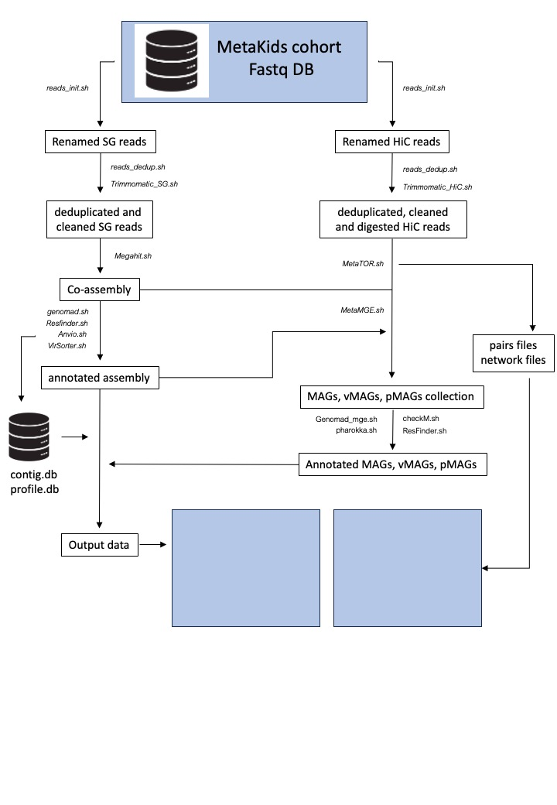

# MetaKids cohort analysis

this set of scripts allows to analyze metagenomic data from the MetaKids cohort.



## Before starting

### set the different arguments and mandatory directories

```sh
out_dir=/pasteur/zeus/projets/p02/rsg_fast/mmarbout/projets/MK/
master_dir=/pasteur/zeus/projets/p02/rsg_fast/mmarbout/projets/MK/scripts/
sample=XX
```


```sh
mkdir -p "$out_dir"/temp/
mkdir -p "$out_dir"/FastQ/HiC_digested/
mkdir -p "$out_dir"/FastQ/SG_cleaned/
mkdir -p "$out_dir"/FastQ/temp/
mkdir -p "$out_dir"/assemblage/
mkdir -p "$out_dir"/annotations/
mkdir -p "$out_dir"/MetaTOR/metator/"$sample"
mkdir -p "$out_dir"/MetaTOR/metamge/"$sample"
mkdir -p "$out_dir"/anvio/
mkdir -p "$out_dir"/coverage/"$sample"/
mkdir -p "$out_dir"/coverage/log/
mkdir -p "$out_dir"/BAM/
mkdir -p "$out_dir"/index/
mkdir -p "$out_dir"/rapport/
```

## Raw reads treatment

### copy the raw from GAIA storage unit and rename them appropriately

NB: do not forget to do that by logging on the sftpcampus server

```sh
bash "$master_dir"/reads_init.sh "$out_dir"/FastQ/"$sample"/ "$sample"
```

### deduplicate the raw reads (do not forget to do FastQC before and after deduplication and to remove host reads)

```sh
sbatch "$master_dir"/reads_dedup.sh "$sample"
```

## Shotgun reads treatment, assembly and annotation

### clean SG reads using Trimmomatic, remove host reads and start the Assembly and its annotation

```sh
sbatch "$master_dir"/Trimmomatic_SG.sh "$sample"
```

NB: this script will automatically launch the script to generate the assembly once the reads have been cleaned and then the different scripts to annotate your assembly (Anvio, resfinder, VirSorter)

### MGEs annotation

launch genomad pipeline (do not forget to activate the conda environment)

```sh
conda activate genomad 
```

```sh
sbatch "$master_dir"/Genomad.sh "$out_dir"/assemblage/"$sample".fa "$out_dir"/annotations/genomad/"$sample"/ "$sample"
```

```sh
conda deactivate
```


## HiC reads process and MetaTOR pipeline

### clean HiC reads using Trimmomatic and digest them

NPO - conda activate metator

```sh
conda activate test_meta
```

```sh
sample=MKXX
```

```sh
for i in $(ls /pasteur/zeus/projets/p02/rsg_fast/mmarbout/projets/MK/FastQ/"$sample"/ | grep "MK" | grep "dedup" |  grep "Arima" | sed 's/_dedup/ /' | awk '{print $1}' | sort -u)
do

	sbatch "$master_dir"/Trimmomatic_HiC.sh "$out_dir"/FastQ/temp/ "$out_dir"/FastQ/"$sample"/"$i"_dedup_R1.fq.gz "$out_dir"/FastQ/"$sample"/"$i"_dedup_R2.fq.gz "$i" 

done
```

### Binning of MAGs using MetaTOR

launch metator pipeline (do not forget to activate the conda environment)

```sh
conda activate test_meta
```

```sh
sample=MKXX
```

```sh
sbatch "$master_dir"/MetaTOR.sh "$out_dir"/MetaTOR/metator/"$sample"/ "$out_dir"/assemblage/"$sample".fa $(ls "$out_dir"/FastQ/HiC_digested/ | sed 's/_clean/ /' | grep "$sample" | awk '{print $1}' | sort -u | awk '{print "'$out_dir'""/FastQ/HiC_digested/"$1"_R1.fq.gz"}' | paste -s | sed 's/\t/,/g') $(ls "$out_dir"/FastQ/HiC_digested/ | sed 's/_clean/ /' | grep "$sample" | awk '{print $1}' | sort -u | awk '{print "'$out_dir'""/FastQ/HiC_digested/"$1"_R2.fq.gz"}' | paste -s | sed 's/\t/,/g')
```

### Binning of MGE using MetaTOR

launch the pipeline MetaMGE

```sh
sbatch "$master_dir"/MetaMGE.sh \
	"$out_dir"/MetaTOR/metamge/"$sample"/ \
	"$out_dir"/MK/MetaTOR/metator/"$sample"/ \
	"$out_dir"/MetaTOR/metamge/"$sample"/contig_mge.txt \
	"$out_dir"/MetaTOR/metamge/"$sample"/contig_mge.fa \
	"$out_dir"/MetaTOR/metator/"$sample"/ \
	alignment 0.8
```

### recovering the Fasta files cleaned for MAGs and MGEs

scrits matrice_generation

### annotation of the retrieved bins (GTDB-tk, CheckM, GeNomad, Pharokka, Iphop and CheckV)

```sh
sbatch "$master_dir"/checkM.sh "$out_dir"/MetaTOR/metator/"$sample"/final_bin/ "$out_dir"/checkM/"$sample"/ "$sample"_MAG
```

### construction of a large contact map encompassing the MGEs and the MAGs


### assignment of MGE to their host and basic analysis


### creation of file for Anvio visualization (script binning_annotation)

1- create a binning.txt file containing the binning data (only encompass MAGs, vMAGS and pMAGs)
ContigXX	bin_XX

2- create a tab delimited file with some annotations


## Contact

### Authors

* martial.marbouty@pasteur.fr

### Research lab

[Spatial Regulation of Genomes](https://research.pasteur.fr/en/team/spatial-regulation-of-genomes/) (Institut Pasteur, Paris)

