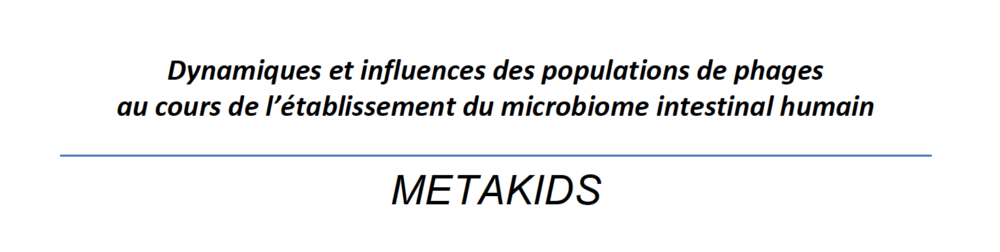

# MetaKids cohort # Practical Course Meta3C

clinical trial NCT03296631

Promoteur: Institut Pasteur
Institut Pasteur - Paris
25-28 rue du Docteur Roux
75724 Paris cedex 15

Responsable(s) Scientifique(s)
Marbouty Martial
Chargé de Recherche – CNRS
Laboratoire Régulation Spatiale des Génomes
UMR3525
Institut Pasteur, Paris, France.

## Contact

### Authors

* martial.marbouty@pasteur.fr

### Research lab

[Spatial Regulation of Genomes](https://research.pasteur.fr/en/team/spatial-regulation-of-genomes/) (Institut Pasteur, Paris)

