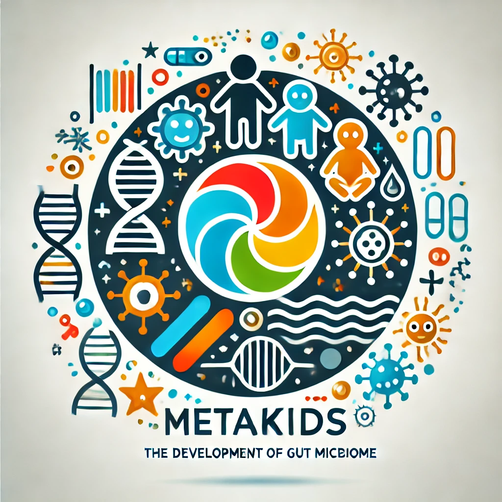

# MetaKids cohort

clinical trial NCT03296631

## Objectives

Over the last decade, the role of microorganisms residing in human intestines has been intensively studied. The intestinal microbiome includes bacteria, viruses, fungi and archaea. The importance of microbiome to human health is highlighted by the observation that dysbiotic shifts in these microbial communities have been associated with numerous human diseases, including obesity, inflammatory bowel disorders, autoimmune disease or gastrointestinal cancer. It is also clearly established that some of these microorganisms interact with the immune system and contribute to its develoment. 

The intestinal microbiome is established soon after birth, and its composition changes over the next several years toward a stereotypical 'adult-like' bacterial community structure. Epidemiological studies have demonstrated the importance of this period for a long-term health. It also has been shown that this process can be influenced by multiple interacting factors such as nutrition, antibiotic use and others environmental factors. Much less is known on the viral part of our microbiome. Most of them are phages (phageome) that are known to modulate microbial population through predation or transfer of genetic information between bacteria, and are likely to have important effects on intestinal microbiome establishment and, consequently, human physiology. 

MetaKids project aims at understanding how the gut phageome develops during the early human life and how it influences the composition of the bacterial microbiome. We have carried a longitudinal study of 15-20 infants from 3-9 months till age 24-30 months. By combining latest metagenomic methods, the goal of the project was to investigate: 1) the composition, evolution and dynamic of the phageome and bacterial microbiome over this critical period; 2) the interactions between phages and bacteria and their relationships; and 3) the impact of environmental factors, like vaccinations or antibiotics treatment on the phages populations. Our project is based on the combination of innovative recent metagenomic techniques developed in the lab. DNA is an ubiquitous and stable molecule that can be used as a marker of "compartmentalization" at cellular and population levels, providing important information regarding the genomic structure and the dynamics of the different DNA molecules present in a microbial community.

## Promoteur

Institut Pasteur - Paris
25-28 rue du Docteur Roux
75724 Paris cedex 15

We thank the CRT from Pasteur and especially Olivia Cheny for its implication in the project.

We thank the city of Orsay for its collaboration in the project.

We thank the MD Gweanelle Le Tinier to have accepted to coordinate the project in the day-care centers.

## Responsable Scientifique

- Marbouty Martial
- Directeur de Recherche – CNRS
- Laboratoire Régulation Spatiale des Génomes
- UMR3525
- Institut Pasteur, Paris, France.

## Github content

the github contains different files describing the cohort, the metadata associated to each sample and the analysis pipeline. 

## Contact

### Authors

* martial.marbouty@pasteur.fr

### Research lab

[Spatial Regulation of Genomes](https://research.pasteur.fr/en/team/spatial-regulation-of-genomes/) (Institut Pasteur, Paris)

